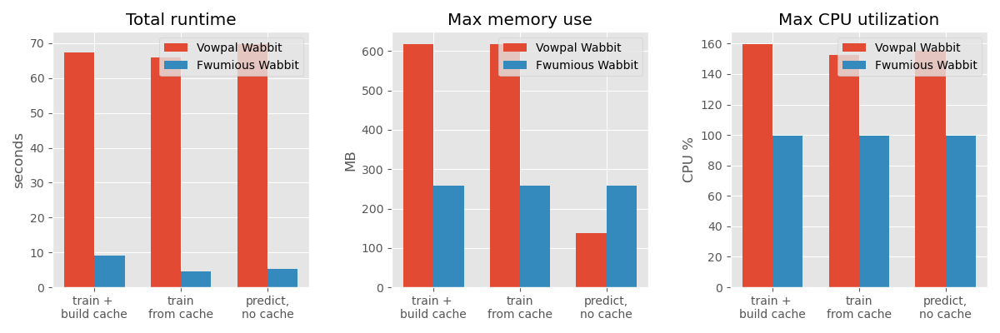

## Setup

### CPU Info
```
Physical cores: 4
Total cores: 8
Current Frequency: 2900.00Mhz
```
### System Information
```
System: Darwin
Version: Darwin Kernel Version 19.6.0: Mon Aug 31 22:12:52 PDT 2020; root:xnu-6153.141.2~1/RELEASE_X86_64
Machine: x86_64
Processor: i386
```
### Dataset details
we generate a synthetic dataset with 10000000 train records and 10000000 test records.

the task is 'Eat-Rate prediction' - each record describes the observed result of a single feeding experiment.

each record is made of a type of animal, a type of food, and a label indicating whether the animal ate the food.

the underlying model is simple - animals are either herbivores or carnivores - regardless of specific animal name,
and food is either plant based or meat based regardless of it's identity.
herbivores always eat plants (and only plants), and carnivores always eat meat (and only meat).

for convenience reasons, we name the animals 'Herbivore-1234' and 'Carnivore-5678', and the food items 'Plant-678'
 and 'Meat-234' so the expected outcome for a record is always clear.

there are 100000 animal types, and 100000 food types.


see for example the first 5 lines from the train dataset (after some pretty-printing):
label|animal|food
-----|------|----
1 |A Carnivore-3669 |B Meat-45474
-1 |A Herbivore-99305 |B Meat-45642
1 |A Herbivore-1514 |B Plant-78491
-1 |A Herbivore-3724 |B Meat-48355
-1 |A Herbivore-49652 |B Meat-27767


## Results

we measure first 3 scenarios:
1. train a new model from a gzipped dataset, generating a gzipped cache file for future runs, and an output model file - *this is a typical scenario in our AutoML system - we start by generating the cache file for the next runs.*
1. train a new model over the dataset in the gzipped cache, and generate an output model - *this is also a typical scenario - we usually run many concurrent model evaluations as part of the model search*
1. use a generated model to make predictions over a dataset read from a text file, and print them to an output predictions file - *this is to illustrate potential serving performance, we don't usually predict from file input as our offline flows always apply online learning. note that when running as daemon we use half as much memory since training gradients are not loaded - only model weights*


### Summary
here are the results for 2 runs for each scenario, taking mean and standard deviation values:


### The numbers
Scenario|Runtime (seconds)|Memory (MB)|CPU %
----|----|----|----
vw train, no cache|74.10 ± 1.37 | 1098 ± 0.05 | 161.00 ± 0.40
fw train, no cache|9.51 ± 0.11 | 258 ± 0.01 | 99.65 ± 0.05
vw train, using cache|77.29 ± 2.57 | 1098 ± 0.02 | 152.80 ± 0.00
fw train, using cache|3.98 ± 0.24 | 258 ± 0.02 | 99.75 ± 0.15
vw predict, no cache|61.89 ± 0.65 | 138 ± 0.01 | 156.65 ± 0.45
fw predict, no cache|4.71 ± 0.16 | 257 ± 0.00 | 99.70 ± 0.20


### Model equivalence
see here the loss value calculated over the test predictions for the tested models:
```
Vowpal Wabbit predictions loss: 0.7187009888444211
Fwumious Wabbit predictions loss: 0.7073477734602737
```


for more details on what makes Fwumious Wabbit so fast, see [here](https://github.com/outbrain/fwumious_wabbit/blob/benchmark/SPEED.md)
